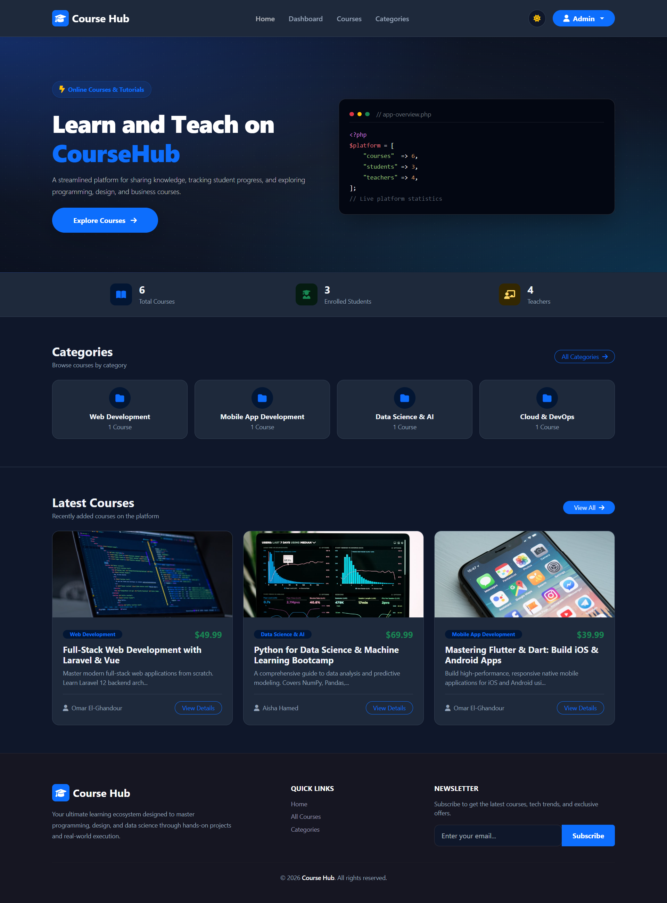
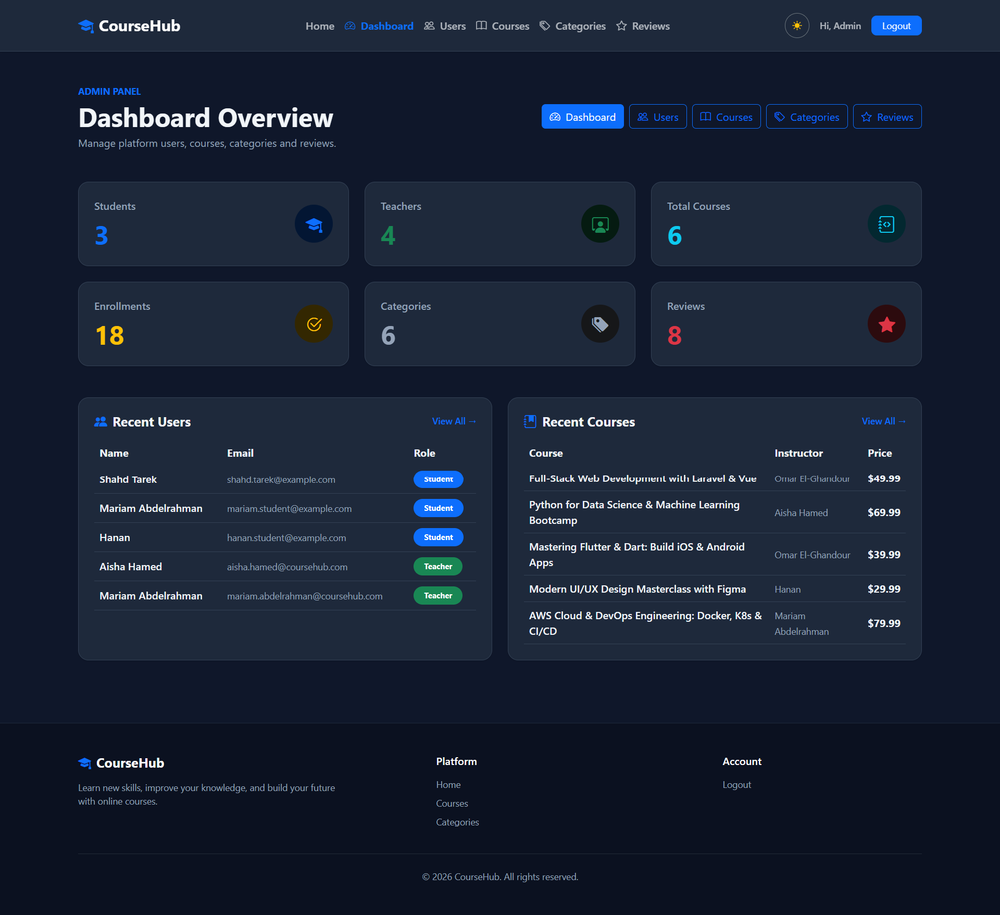

 # Course Hub - Learning Management & Course Platform 🎓

<p align="center">
  
  
  
  
  
</p>

**Course Hub** is a modern, responsive, and full-featured e-learning web application built with **Laravel 12**, **Blade**, and **Bootstrap 5**. It provides a comprehensive ecosystem tailored for three primary user roles: **Students**, **Instructors (Teachers)**, and **Administrators**.

---

## 📸 Screenshots & Application Showcase

<p align="center">
  
</p>

<table align="center" width="100%">
  <tr>
    <td width="50%" align="center">
      <strong>🛡️ Admin Dashboard (Dark Mode Overview)</strong><br><br>
      
    </td>
    <td width="50%" align="center">
      <strong>⭐ Course Details, Reviews & Student Feedback</strong><br><br>
      
    </td>
  </tr>
</table>

---

## 🌟 Key Features & Capabilities

### 👨‍🎓 Student Experience
- **Course Discovery & Instant Enrollment**: Browse courses across various categories with detailed syllabi, instructor information, and one-click enrollment.
- **Dedicated Student Dashboard**:
  - Overview of enrolled courses with category badges and instructor tags.
  - Real-time overall progress calculation (`(completed lessons / total lessons) * 100`).
  - Quick-access "Continue Learning" actions.
- **Interactive Lesson Player**:
  - Immersive video player with course lesson outlines and navigation.
  - Lesson description, duration, and completion status.
- **Course Quizzes & Assessments**:
  - Take quizzes associated with enrolled courses.
  - Automated grading and instant percentage feedback upon submission.
- **Course Reviews & Ratings**:
  - Submit 5-star ratings and written feedback on enrolled courses.
  - Unique constraint per student per course to prevent duplicate ratings.
- **Profile Management**:
  - Update personal information (name, email, secure password changes).
  - Profile avatar upload and storage.

---

### 👨‍🏫 Instructor Workspace
- **Instructor Dashboard**:
  - Real-time metrics: Total created courses, total enrolled students, and dynamic aggregated average course rating.
  - Quick-manage list of all authored courses.
- **Course Management (Full CRUD)**:
  - Create, view, edit, and delete courses.
  - Upload course cover images stored safely in public storage.
  - Assign categories, set pricing, and write comprehensive descriptions.
- **Lesson Management**:
  - Add, update, and remove video lessons per course.
  - Configure video URLs, durations, and lesson notes.
  - Authorization guards ensure instructors only manage their own course lessons.
- **Student Enrollment Directory**:
  - Search enrolled students by name or email.
  - Filter enrolled students by specific course.
  - Optimized database queries using Eager Loading (`with('enrolledCourses')`).

---

### 🛡️ Administration & Control Center
- **System Dashboard**:
  - High-level platform analytics: Total students, instructors, courses, active enrollments, categories, and reviews.
  - Recent user registrations and latest published courses.
- **User Management**:
  - Complete user administration (create, update, view, and delete).
  - Role management: easily assign or switch user roles (`admin`, `teacher`, `student`).
- **Category Management**:
  - Create and manage course categories with custom icons and image uploads.
  - Course count tracking per category.
- **Global Course & Content Oversight**:
  - Moderate courses across all instructors.
- **Review Moderation**:
  - Monitor student feedback and remove inappropriate ratings or comments.

---

### 🎨 Design, UI & UX Highlights
- **Dark & Light Mode**: Seamless theme switching with instantaneous persistence via `localStorage`.
- **Fully Responsive Design**: Optimized layout across mobile, tablet, and wide desktop screens.
- **Dynamic Landing Page**:
  - Eye-catching Hero section with quick call-to-actions.
  - Dynamic KPI statistics counter (live counts of students, courses, and teachers).
  - Featured courses carousel/grid.
  - Top categories showcase.
  - Student testimonials and newsletter subscription banner.
- **Modern Typography & Icons**: Integrated with FontAwesome 6, Bootstrap Icons, and clean CSS variables.

---

### 🔐 Security & Architecture
- **Role-Based Access Control (RBAC)**: Protected via custom `admin` middleware and controller authorization checks.
- **Anti-Tampering Safeguards**: Instructors are prevented from submitting reviews on their own courses.
- **Optimized Queries**: Leverages Laravel Eloquent relationships (`belongsTo`, `hasMany`, `belongsToMany`) with `withCount` and `withAvg` to eliminate N+1 query bottlenecks.
- **Secure File Handling**: Image uploads use Laravel Storage Disks with automated cleanup on deletion.
- **CSRF & XSS Protection**: Standard Laravel security tokens on all POST/PUT/DELETE forms.

---

## 🛠️ Technology Stack

| Component | Technology |
|---|---|
| **Backend Framework** | [Laravel 12.x](https://laravel.com/) |
| **Language** | [PHP 8.3+](https://www.php.net/) |
| **Frontend Engine** | Laravel Blade Templates |
| **CSS Framework** | [Bootstrap 5.3](https://getbootstrap.com/) |
| **Icons** | [Font Awesome 6](https://fontawesome.com/) & [Bootstrap Icons](https://icons.getbootstrap.com/) |
| **Build Tool** | [Vite](https://vitejs.dev/) |
| **Database** | MySQL / MariaDB (or SQLite) |
| **Authentication** | Laravel UI |

---

## 🚀 Installation & Setup Guide

### Prerequisites
Make sure you have the following installed on your machine:
- **PHP** >= 8.2 with PDO, OpenSSL, Mbstring, and cURL extensions.
- **Composer**
- **Node.js** & **NPM**
- **MySQL** (e.g., via XAMPP)

---

### 1. Clone the Repository
```bash
git clone https://github.com/omar-mahmoud-2004/course-hub.git
cd course-hub
```

### 2. Install PHP Dependencies
```bash
composer install
```

### 3. Install Frontend Dependencies
```bash
npm install
```

### 4. Configure Environment Variables
Duplicate `.env.example` to `.env`:
```bash
cp .env.example .env
```
Generate the application key:
```bash
php artisan key:generate
```

### 5. Configure the Database
In your `.env` file, configure your MySQL credentials:
```env
DB_CONNECTION=mysql
DB_HOST=127.0.0.1
DB_PORT=3306
DB_DATABASE=courses-platform
DB_USERNAME=root
DB_PASSWORD=
```

### 6. Run Migrations & Seeders
Run migrations to create the database schema and populate the default administrator account:
```bash
php artisan migrate --seed
```

### 7. Link Public Storage
Ensure uploaded images (courses, categories, and avatars) are accessible publicly:
```bash
php artisan storage:link
```

### 8. Build Assets & Start the Server
Compile assets:
```bash
npm run build
```

Start the Laravel development server:
```bash
php artisan serve
```

Visit the application in your browser:
```
http://127.0.0.1:8000
```

---

## 🔑 Default Demo Accounts & Credentials

When database seeders are executed (`php artisan migrate --seed`), ready-to-test accounts for every role are available:

| Role | Name | Email | Password |
|---|---|---|---|
| **Admin** | Admin | `admin@admin.com` | `12345678` |
| **Teacher** | Teacher | `teacher@teacher.com` | `12345678` |
| **Student** | Student | `student@student.com` | `12345678` |

---

## 📁 Project Directory Structure

```text
course-hub/
├── app/
│   ├── Http/
│   │   ├── Controllers/
│   │   │   ├── Admin/         # Admin Dashboard, User, Course, Category, Review Controllers
│   │   │   ├── Auth/          # Authentication & Password Controllers
│   │   │   ├── CourseController.php
│   │   │   ├── LessonController.php
│   │   │   ├── ReviewController.php
│   │   │   └── StudentController.php
│   │   └── Middleware/        # AdminMiddleware & route guards
│   └── Models/                # Eloquent Models (User, Course, Lesson, Quiz, Review, etc.)
├── database/
│   ├── migrations/            # Schema definitions with foreign keys
│   └── seeders/               # Database seeders (AdminUserSeeder, DatabaseSeeder)
├── public/
│   ├── assets/                # Static CSS and JS assets
│   ├── uploads/               # User upload directories
│   └── storage/               # Symlink to storage/app/public
├── resources/
│   ├── views/
│   │   ├── admin/             # Admin panel views
│   │   ├── auth/              # Login, register, password reset views
│   │   ├── courses/           # Course catalogs and CRUD views
│   │   ├── layouts/           # App, Admin, and base layouts
│   │   ├── lessons/           # Lesson creation and editing views
│   │   ├── student/           # Student dashboard, quiz, profile, course player views
│   │   ├── teacher/           # Teacher dashboard and student listings
│   │   └── welcome.blade.php  # Landing page
│   ├── css/
│   └── js/
├── routes/
│   ├── web.php                # Web routes organized by role & prefix
│   └── console.php            # Artisan commands
└── storage/                   # App logs, sessions, framework cache, and uploaded media
```

---

## 👨‍💻 Author & Acknowledgements

Developed by **[Omar Mahmoud](https://github.com/omar-mahmoud-2004)**.  
Feedback and contributions are always welcome!

